# DisplayPlatform
Repository of information regarding the Shadowfoil Display Platform

# JFO Saber Stand

## TouchSense PCB
The TouchSense PCB is a custom PCB designed in house by Shadowfoil Props to power the JFO Saber Stand. The PCB uses a JSM8233 touch sensor (functionally identical to TTP223), has an onboard touch sensitive red LED, 4 JST SH1.0 (1mm pitch) connectors, and a CR2032 coin cell battery holder. 

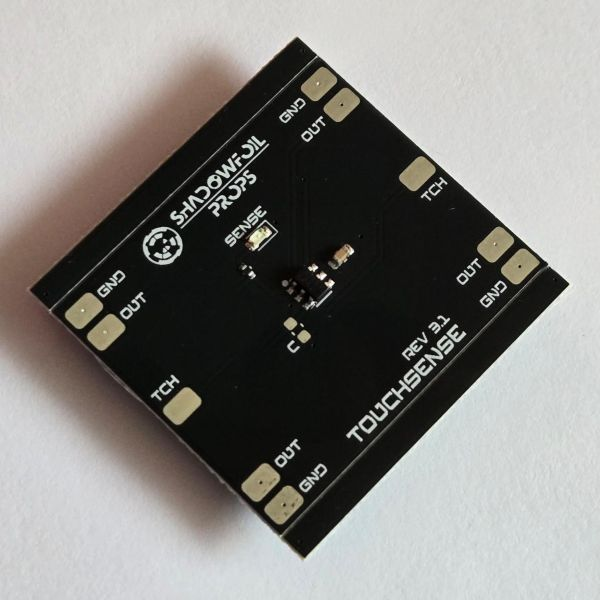
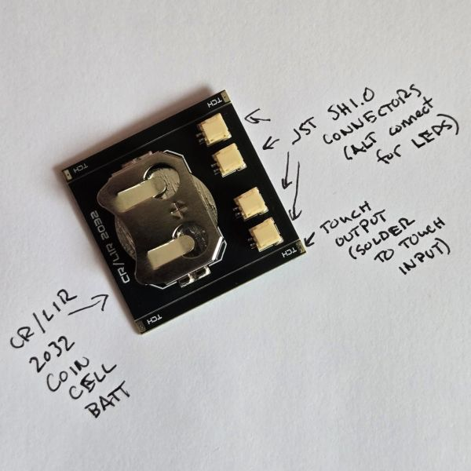

### Touch Rails
The touch rails are v-cut at the fab and can be gently removed for assembly in the saber stand. We recommend using the edge of a table or toothless pliers to break at the v-cut.

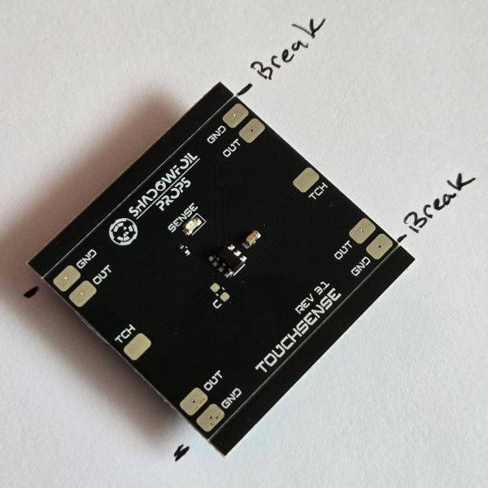
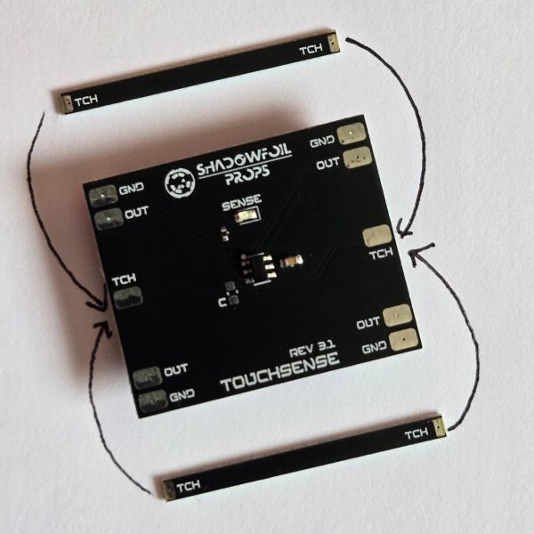

### Wiring
The PCB supports both hardwired LED connections at each corner or four JST SH1.0 connectors for quick disconnects. The TCH pads on either side are for touch input leads.

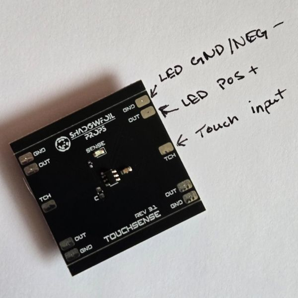

JST Connectors are accessible from one side of the PCB if you prefer to have quick disconnects for your LEDs.

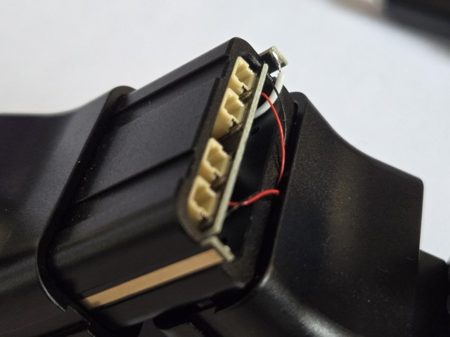

Careful not to damage the wires when adjusting the angle of the arms!

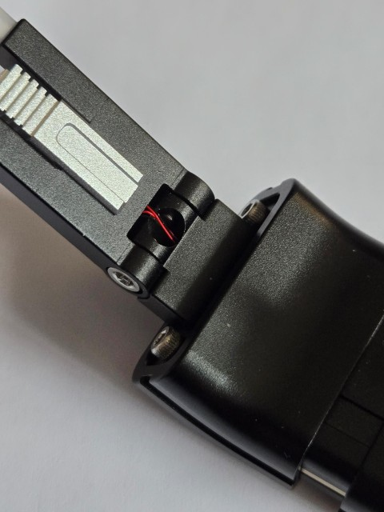

### Battery
The TouchSense PCB runs on a standard CR2032 coin cell battery and should get around 24 hours of continuous on-time. If you prefer rechargeable batteries you can instead opt to using a lithium ion LIR2032 in it's place and remove to recharge it.

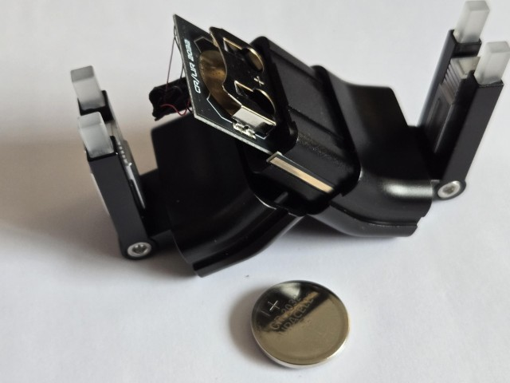

## Installation
### Prep work:
1. Glue pre-wired 0402 LEDs to the underside of the acrylic posts with a drop of CA/Super glue.
2. Allow these to dry fully before continuing
3. Ensure you have 1.5mm, 2mm, and 2.5mm hex drivers

### Disassembly:
1. Remove underside hex screws with 1.5mm driver. (These can also be loosened to adjust the width of the stand)

    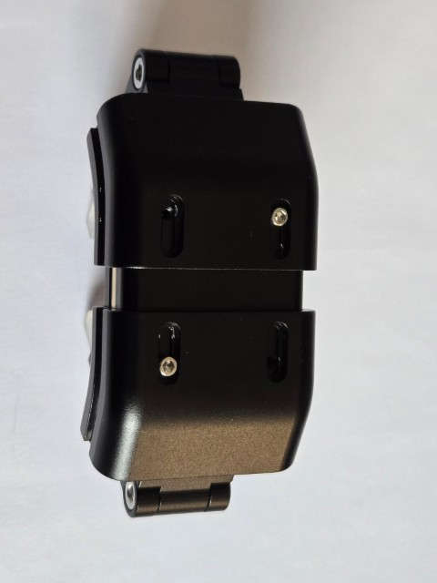
2. Slide arm assemblies off the center body
3. Using 2.5mm hex driver, remove the larger hex screws on the arm sides to separate the upper and lower portions of the arm assembly.
4. Using 2mm hex driver, remove the single set screw from each arm.

### Assembly:
1. Once the glue has dried on the acrylic posts gently thread the wires down through the upper portion of the arm assembly. This may take some gentle finangling to get the wires to thread out the center hole in the bottom of the upper arm. Tweezers can be helpful at this step.
2. Next, carefully thread the wire ends through the center of the lower half of the arm assembly so that it extends into the area shared with the center piece.
3. Re-insert the screws for the arm assembly removed during disassembly. The arm angle can be adjusted before tightening screws as desired.
4. If using connectors solder them to the LED wire leads, if hardwiring you can solder the wires directly to the GND and OUT pads of the PCB.
5. Gently break the touch rails off the main PCB.

    
6. Solder a wire from one of the TCH pads on the rails to either TCH pad on the main PCB, these touch rails will sit in the groove on either side of the center body. The TCH pads should extend slighlty past the end on either side.

    

    
7. Once all soldering and connections are complete, insert a CR/LIR 2032 coin cell battery into the PCB's battery holder. Attaching a small amount of tape to the battery edge can make it easier to remove later.
8. Verify LEDs all toggle on and off with consecutive touches on the touch rails. The red led on the main pcb is a GRC (gross reality check) output to verify touch input without external LEDs.
9. Place the touch rails into the grooves on the center body
10. Re-attach the side assembly to the center body, pinning the touch rails in place.

    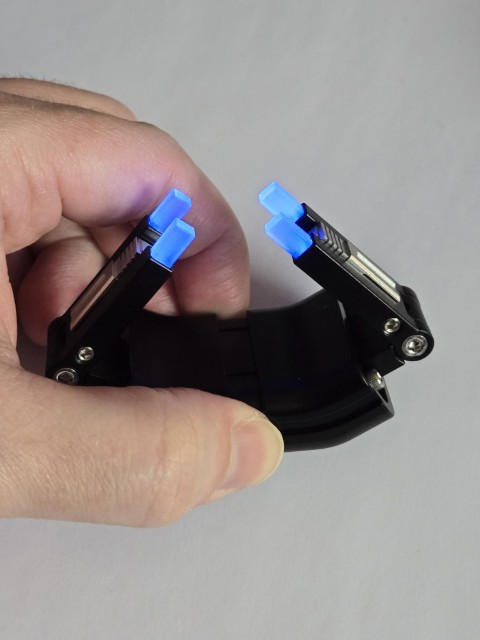

## Adjustment

### Side Arm Angle
Adjust the angle of the arms as desired by loosening side screws and rotating it. Be careful not to break the wires by over-rotating.

### Bottom Width
Adjust the width of the bottom assembly by loosening the underside screws and sliding the arms in or out. 

## Battery replacement
When the battery dies, remove the arm assembly that exposes the battery slot. Gently pull the PCB out enough to remove the battery. Tape or a small tool can be helpful in pulling/pushing the battery free. Insert a fresh battery and re-assemble.
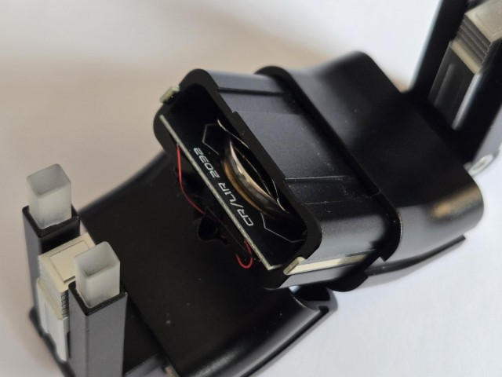

# JFO Workbench
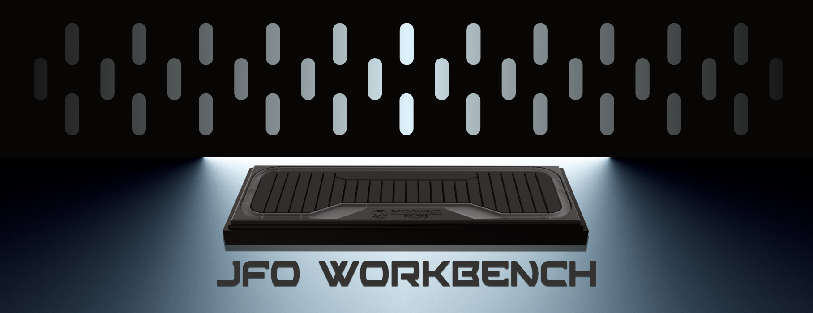

## Workbench PCB

## WLED